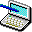
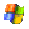
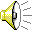
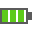
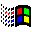
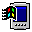
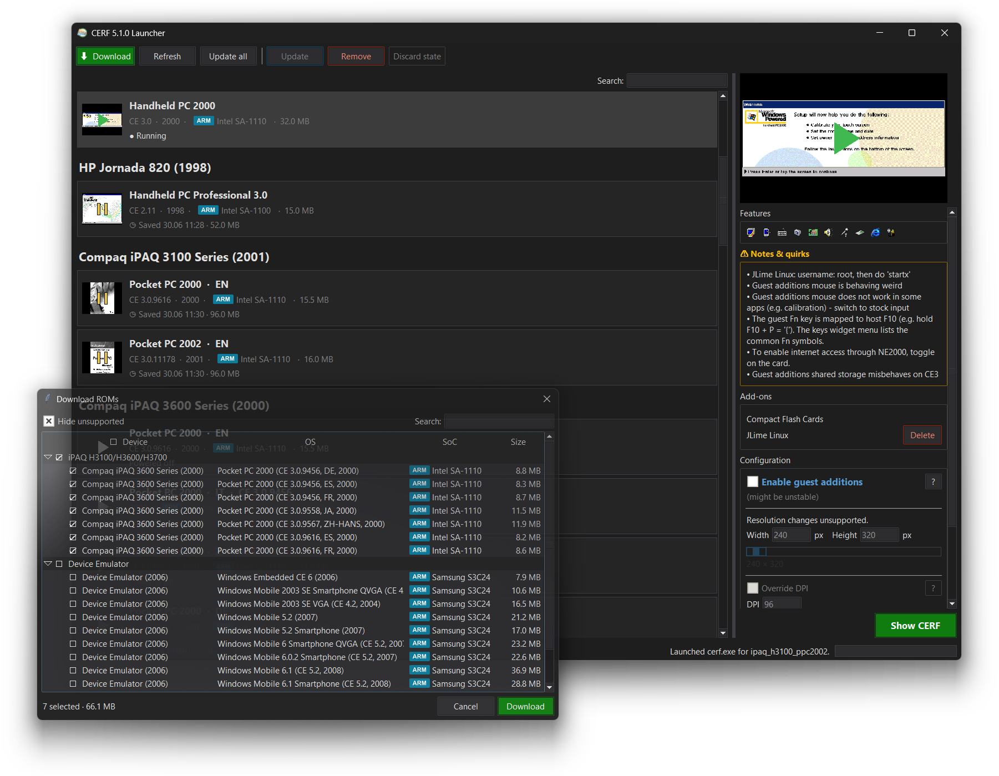

#  **CE Runtime Foundation** v6.0 pre-alpha [](https://discord.gg/QREE9Y2v2d)

A universal Windows CE emulator: a virtual hardware platform that boots real CE and Windows Mobile ROMs on modern Windows.

> [!WARNING]
> **Early stage.** There are some bugs and boards are just MVP implementations. Some boards lack proper clocks, timings, caches, etc. - take into account. Today this is rather proof-of-concept. Contributions are welcome!

<p align="center">
  <a href="https://www.youtube.com/watch?v=LmfaXUNGFlU">
    
  </a>
</p>

## Downloads

Download WIP build (6.0) from artifacts [](https://github.com/gweslab/cerf/actions/workflows/build.yml) to use all the latest features or go to [latest release](https://github.com/gweslab/cerf/releases/latest)

## Supported boards

<table>
  <thead>
    <tr>
      <th>SoC</th>
      <th>Board / OS</th>
      <th>Features</th>
    </tr>
  </thead>
  <tbody>
    <tr>
      <td rowspan="2" align="center"><br/><b>Intel XScale PXA255</b><br/><sub>ARMv5TE</sub></td>
      <td>
         <b>Falcon 4220</b> <code>falcon_4220</code><br/>
         Windows CE .NET
      </td>
      <td>       </td>
    </tr>
    <tr>
      <td>
         <b>NEC MobilePro 900</b> <code>nec_mobilepro_900</code><br/>
         Handheld PC 2000<br/>
         Windows CE .NET
      </td>
      <td>      </td>
    </tr>
    <tr>
      <td align="center"><br/><b>Freescale i.MX51</b><br/><sub>Cortex-A8</sub></td>
      <td>
         <b>Ford SYNC 2</b> <code>ford_sync_2</code><br/>
         Windows CE 6
      </td>
      <td> </td>
    </tr>
    <tr>
      <td rowspan="4" align="center"><br/><b>Intel SA-1110</b><br/><sub>StrongARM</sub></td>
      <td>
         <b>HP Jornada 720</b> <code>jornada_720</code><br/>
         Handheld PC 2000
      </td>
      <td>        </td>
    </tr>
    <tr>
      <td>
         <b>iPAQ H3100/H3600/H3700</b> <code>ipaq_gen1</code><br/>
         Pocket PC 2000<br/>
         Pocket PC 2002
      </td>
      <td>       </td>
    </tr>
    <tr>
      <td>
         <b>Siemens SIMpad SL4</b> <code>simpad_sl4</code><br/>
         Handheld PC 2000<br/>
         Windows CE .NET
      </td>
      <td>      </td>
    </tr>
    <tr>
      <td>
         <b>SmartBook G138</b> <code>smartbook_g138</code><br/>
         Windows CE .NET
      </td>
      <td>      </td>
    </tr>
    <tr>
      <td align="center"><br/><b>Intel SA-1100</b><br/><sub>StrongARM</sub></td>
      <td>
         <b>HP Jornada 820</b> <code>jornada_820</code><br/>
         Handheld PC 3.0 Professional
      </td>
      <td>        </td>
    </tr>
    <tr>
      <td align="center"><br/><b>ARM720T</b><br/><sub>ARMv4T</sub></td>
      <td>
         <b>Microsoft Windows CE Hardware Reference Platform</b> <code>odo</code><br/>
         Windows CE 2.11<br/>
         Windows CE 3
      </td>
      <td>    </td>
    </tr>
    <tr>
      <td align="center"><br/><b>NEC VR4102</b><br/><sub>MIPS III</sub></td>
      <td>
         <b>NEC MobilePro 700</b> <code>nec_mobilepro_700</code><br/>
         Windows CE 2.0
      </td>
      <td>   </td>
    </tr>
    <tr>
      <td align="center"><br/><b>NEC VR5500</b><br/><sub>MIPS IV</sub></td>
      <td>
         <b>NEC Rockhopper SG2_VR5500</b> <code>nec_rockhopper</code><br/>
         Windows CE 6
      </td>
      <td>     </td>
    </tr>
    <tr>
      <td align="center"><br/><b>TI OMAP 3530</b><br/><sub>Cortex-A8</sub></td>
      <td>
         <b>OMAP 3530 EVM</b> <code>omap_3530_evm</code><br/>
         Windows CE 7
      </td>
      <td>   </td>
    </tr>
    <tr>
      <td rowspan="2" align="center"><br/><b>Samsung S3C2410</b><br/><sub>ARM920T</sub></td>
      <td>
         <b>Siemens P177</b> <code>siemens_p177</code><br/>
         Windows CE 5
      </td>
      <td>  </td>
    </tr>
    <tr>
      <td>
         <b>Device Emulator</b> <code>devemu</code><br/>
         Windows CE 6<br/>
         Windows Mobile 5<br/>
         Windows Mobile 6<br/>
         WM 2003 SE<br/>
         Windows CE 5
      </td>
      <td>        </td>
    </tr>
    <tr>
      <td align="center"><br/><b>Freescale i.MX31L</b><br/><sub>ARM1136</sub></td>
      <td>
         <b>Zune 30</b> <code>zune_30</code><br/>
         Windows CE 5
      </td>
      <td>  </td>
    </tr>
  </tbody>
</table>

## Usage

The easiest way to run CERF is **`launcher.exe`** - a GUI app shipped next to `cerf.exe` that downloads publicly available ROM bundles and boots them. Pick a device from the list, tweak launch options (resolution, logging, network) if you want, click **Launch CERF**.



For direct invocation without the launcher:

| Command                        | Action                                                       |
| ------------------------------ | ------------------------------------------------------------ |
| `cerf.exe `                    | Boot default device (cerfos)                                 |
| `cerf.exe --device=devemu_ce6` | Boot specific device                                         |
| `cerf.exe --log=ALL`           | Enable every log channel                                     |
| `cerf.exe --flush-outputs`     | Force-flush logs (avoid truncation on crash, extremely slow) |

Logs are written to `cerf.log` next to the executable. On a fatal crash, every other thread's register state and a top-of-stack snapshot is dumped to `cerf.crash.log` next to it. Run `cerf.exe --help` for the full CLI.

> [!NOTE]
> **`cerf.log` is quiet by default** - only critical `CERF` / `CAUTION` lines are written. Pass `--log=ALL` (or a channel list, e.g. `--log=BOOT,JIT,MMU`) to turn channels on.

##  Guest Additions

<p align="center">
  
</p>

## Running ROM images (NK.BIN, etc.)

> [!IMPORTANT]
> **CERF is not a "drop any CE ROM and go" emulator.** It emulates a _whole device_ - the SoC, the board wiring, the memory map (OAT), and every peripheral the ROM's drivers touch. A ROM only boots if **that exact board has been implemented in CERF**. A matching SoC is **not** enough: the same chip on a different board has different RAM/flash addresses, a different display controller, different GPIO wiring, etc., and the ROM will fail immediately without them. Random ROMs pulled from the internet will not boot unless their board is on the [supported list](#supported-boards).

### Running a ROM for a board CERF already supports

Use **`launcher.exe`** - it downloads the right ROM bundle and boots it. That's the whole flow for normal use.

If you have your own dump for a board that's **already supported** (e.g. a different region/revision of the same device), drop it in by hand:

1. Create a folder under `devices/` (next to `cerf.exe`), e.g. `devices/mydump/`.
2. Put the ROM image in it (e.g. `mykernel.nb0`).
3. Add a `cerf.json` in that folder naming the board and the ROM file:

   ```json
   {
     "board": { "id": "jornada_720" },
     "rom":   { "primary": "mykernel.nb0" }
   }
   ```

   The board id is the one for your device - see the **Supported boards** table above, or run `cerf.exe --help` for the full list.
4. Run `cerf.exe --device=mydump`.

The board id and the primary ROM are both required - give them in `cerf.json` as above, or on the command line: `cerf.exe --device=mydump --board-id=jornada_720 --rom-primary=mykernel.nb0`. `rom.primary` can name the OEM file as shipped, not just a flat image: CERF unwraps recognised containers (multi-XIP, vendor packages) and serves whole-storage dumps (NAND/flash images) on its own - see [how CERF boots ROM containers](agent_docs/rom_acceptance.md). Beyond the two required fields, `cerf.json` is optional and carries display metadata plus a few board overrides (configurable-resolution boards, network tweaks); see [device_config.h](cerf/core/device_config.h) for the schema.

### Bringing up a board CERF does _not_ support yet

This is **real emulator development**, not a config tweak and not something you can hand to an AI and expect magic. The board's exact memory map (OAT), every peripheral its drivers touch, the SoC quirks - all of it has to be implemented in C++, correctly, by someone who understands the hardware. It takes real skill. There are two honest paths:

- **Contribute a proper implementation.** Do it right - the code quality bar is whatever CERF already ships, no lower. That means a correct OAT (not a reused one from another board with `if` cases bolted on), real per-board peripherals (not board-specific behavior stuffed into shared SoC code), and accuracy grounded in datasheets/BSP/RE - not values that happen to "work." Contributions below that bar create more debugging cost than they save and won't be accepted.
- **Just submit the ROM.** If you can't implement it yourself, share the dump and the board details. Maybe someone picks it up someday - **no promises, no timeline.**

CERF does ship a Claude Code dev environment and a `/start-board-implementation` skill that can _assist_ a capable contributor (see [Claude Development Environment](#-claude-development-environment) below), but it is a tool for someone who already knows what a correct bring-up looks like - not a substitute for that knowledge.

## Building

Requires Visual Studio 2026 with the C++ desktop development workload.

> [!NOTE]
> **First build on a fresh machine takes 1+ hour.** vcpkg compiles dependencies from source before CERF starts linking. This happens once per machine - subsequent builds reuse the cached `vcpkg_installed/` tree and finish in a few minutes. Do not interrupt the first build.

Initialise source/dependency submodules:

```
git submodule update --init --recursive
```

Build via the helper script:

```
powershell -ExecutionPolicy Bypass -File build.ps1
```

Or invoke msbuild directly:

```
msbuild cerf.sln /p:Configuration=Release /p:Platform=Win32
```

## Changelog

<table>
  <thead>
    <tr>
      <th>Version</th>
      <th>Release Date</th>
      <th>Changes</th>
    </tr>
  </thead>
  <tbody>
    <tr>
          <td>v5.1</td>
          <td>TBA</td>
          <td>
            <ul>
              <li>MIPS JIT engine</li>
              <li>NEC Rockhopper SG2_VR5500 support</li>
              <li>NEC MobilePro 700 support</li>
              <li>Ford Sync 2 bare-bones support</li>
              <li>(PLANNED) Philips Velo 1, Philips Nino 300 support</li>
              <li>UX/UI improvements</li>
              <li>Launcher full redesign: save settings, fully new layout, multidownload, live/suspened screen previews</li>
              <li>Added tools\fileserver.py in build directory (simple directory serving web server)</li>
              <li>Microsoft Reference Platform: added full PS/2 key mapping set</li>
              <li>Removed heuristics board detector - it was a bad non-scalable conception, now you need to specify board ID directly.
                This also lets users to run ROMs on other boards. Obviously if it's not the same device the chance it will work is around 0%.</li>
              <li>romdump.exe for MIPS updated to emit MIPS1 code, support CE 2.0 and maybe 1.0 too, and now includes several real MIPS CPUs, + full UI redesign</li>
              <li>...more updates pending</li>
            </ul>
          </td>
        </tr>
    <tr>
          <td>v5.0</td>
          <td>18 Jun 2026</td>
          <td>
            <ul>
              <li>iPaqs now use original .nbf format instead of normalized .nb0. <b>Upgrade bundle in launcher!</b></li>
              <li>New boards booting: Jornada 820, Siemens SIMpad SL4, Siemens SIMATIC HMI TP 177B, NEC MobilePro 900 Series, SmartBook G138</li>
              <li>Experimental hibernation/state saving system for all boards</li>
              <li>Added HP Palmtop VGA (F1252A) card</li>
              <li>Soft/hard reset fixes for some SoCs</li>
              <li>UI refresh/updates for CERF and launcher</li>
              <li>PC Cards: Serial modem emulator and serial forwader</li>
              <li>Added Keyboard mapping window for boards with keyboard</li>
              <li>Guest additions: DDraw export (now Zune and friends render, but might be broken in some cases)</li>
              <li>Guest additions: IMGFS injection fixes (e.g. WM >= 6)</li>
              <li>Guest additions: change resolution on Windows CE 3 at runtime with soft reset</li>
              <li>Guest additions: XIP injection improvements</li>
              <li>Guest additions: Keyboard support</li>
              <li>Guest additions: Windows CE 2.11 support</li>
              <li>Guest additions: DPI support</li>
              <li>SA-1110, PXA255 RTC implementation</li>
              <li>Falcon 4220 main battery wiring (fixes the idle suspend problem)</li>
              <li>Suspend feature support for different SoCs</li>
              <li>Ipaq 1st gen: microphone support</li>
              <li>ce_apps/xplorer.exe - dependency-free minimal shell, CE2+, useful for Zune 30 GA mode</li>
            </ul>
          </td>
        </tr>
    <tr>
          <td>v4.0</td>
          <td>8 Jun 2026</td>
          <td>
            <ul>
              <li>NE2000 is now hot pluggable in all boards that support PCMCIA</li>
              <li>Compact Flash too with configurator/generator</li>
              <li>iPaq 1st gen now has extensions sleeve emulated (for PCMCIA support)</li>
              <li>iPaq H3100: monochrome screen inversion fixed</li>
              <li>Soft/hard reset your device in Actions menu (might be broken for some SoCs) + corresponding SoC/peripheral updates</li>
              <li>Guest additions: task manager on host - see process list, switch to processes, kill and run right from HOST window</li>
              <li>NE2000 internet delivery hangs are fixed</li>
              <li>Jornada720/SA1110/JIT updates to make it boot Linux-based OS</li>
              <li>Launcher: optional packages feature</li>
              <li>Guest additions: Complete overhaul of XIP injection (Now you can boot Jornada 720 in 4K. Also suddenly Zune 30 is in the game too)</li>
              <li>Various UI/general fixes, improvements</li>
            </ul>
          </td>
        </tr>
    <tr>
          <td>v3.21</td>
          <td>6 Jun 2026</td>
          <td>
            <ul>
              <li>iPaq H3100 support</li>
              <li>iPaq H3100,H3600 PPC2002 sound fixes</li>
              <li>Jornada 720 support</li>
              <li>JIT/MMU improvements</li>
            </ul>
          </td>
        </tr>
    <tr>
          <td>v3.20</td>
          <td>5 Jun 2026</td>
          <td>
            <ul>
              <li>Falcon 4220 board MVP support</li>
              <li>Launcher updates</li>
            </ul>
          </td>
        </tr>
    <tr>
          <td>v3.11 (For Workgroups)</td>
          <td>4 Jun 2026</td>
          <td>
            <ul>
              <li>Guest Additions: various video driver improvements/fixes</li>
              <li>Guest Additions: accelerated mouse pointer (configurable at runtime; scroll wheel on newer OS)</li>
              <li>Guest Additions: shared folders with host</li>
              <li>Guest Additions: auto screen resolution change on host window resize</li>
              <li>Falcon 4220 board partial implementation (OS boots to UI but hangs)</li>
              <li>Various bug fixes and improvements</li>
            </ul>
          </td>
        </tr>
    <tr>
      <td colspan="2"><b>Previous versions</b> - see the <a href="docs/changelog.html">full changelog</a>.</td>
    </tr>
  </tbody>
</table>

## Known Issues

See [launcher's boards details database](launcher/supported_devices.py) for per-board issues.

## Claude Development Environment

> [!CAUTION]
> **DO NOT USE CERF CODEBASE AS REFERENCE FOR SoCs, BOARDS, PERIPHERALS** - AI WRITTEN CODE CAN'T BE TRUSTED!

100% generated by [Claude](https://claude.ai) via [Claude Code](https://docs.anthropic.com/en/docs/claude-code) - no human-written code. Not production-grade.

---

CERF ships a Claude Code-based development environment for working on the emulator - including bringing up brand-new boards from their ROMs. Launch it from the repo root with:

```
run_claude.cmd
```

It runs Claude Code with a custom system prompt that injects the **entire project documentation** (`CLAUDE.md` plus every `agent_docs/` reference page) into every agent, so each session starts fully briefed on the project's rules, architecture, and subsystems - no "please read the docs first" needed.

The environment provides the **`/start-board-implementation`** skill: drop your ROM into `bundled/devices/` (or just point the agent at it) and run the skill. The agent identifies the board and SoC straight from the ROM, checks what CERF already supports, estimates the effort, and - on your go-ahead - starts the bring-up with a cross-session tracking document. So you can literally drop in your ROM and start the procedure of bringing it up.

> [!WARNING]
> The dev environment runs Claude in skip-permissions mode - it can execute anything on your machine without prompting. It also force-kills its own Claude instance, and **any** `clangd.exe`, that leaks memory past a threshold. The first launch shows a one-time explanation; press Enter to acknowledge it.

## Third-party / Credits

- **[QEMU](https://www.qemu.org/)**
- **[The Linux kernel](https://www.kernel.org/)**
- **[nlohmann-json](https://github.com/nlohmann/json)**
- **[libslirp](https://gitlab.freedesktop.org/slirp/libslirp)**
- JIT studied/inspired by Microsoft's Device Emulator (Shared Source Academic License, 2006)
